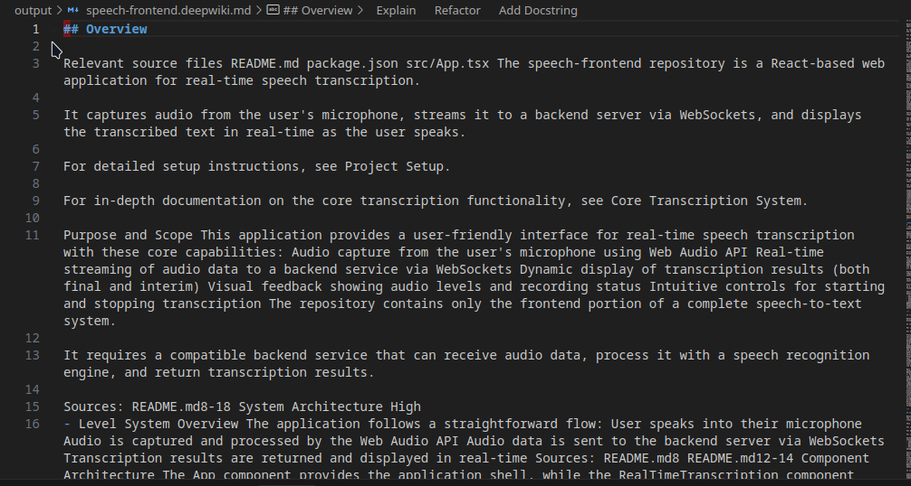
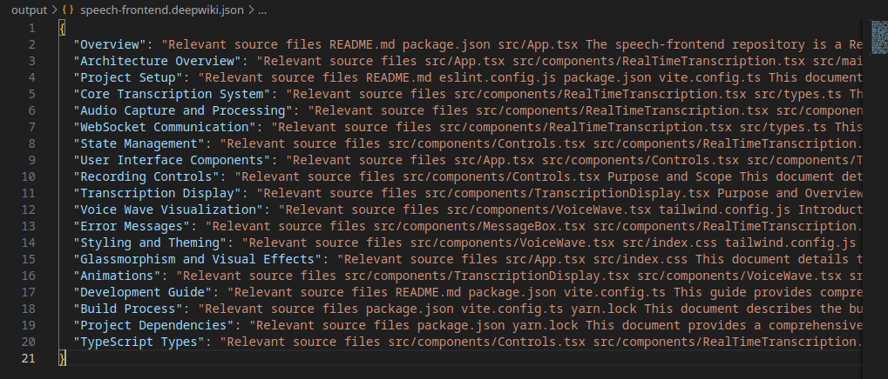
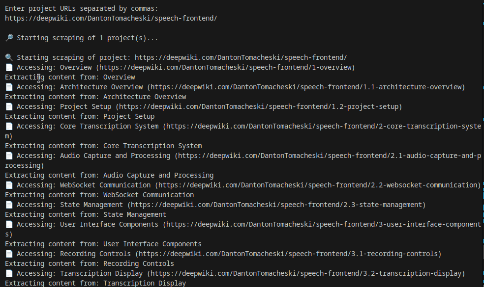

# Documentation Scraper

A command-line utility to extract content from any documentation site (including DeepWiki) and export it as JSON and Markdown files.

## Description

Documentation Scraper is a Node.js/TypeScript tool that automates the extraction of content from any documentation site. The tool intelligently discovers and traverses navigation links, extracts content from each page, and compiles everything into comprehensive JSON and Markdown files for offline reference or integration with other tools.

The scraper supports two modes:
- **Generic Mode** (default): Works with any documentation site (Tailwind CSS, React, Vue, etc.)
- **DeepWiki Mode**: Specialized for extracting from DeepWiki sites

## Features

- **Universal Compatibility**: Works with virtually any documentation site that has a navigable structure
- **Automatic Discovery**: Intelligently finds navigation menus and documentation paths
- **Smart Crawling**: Uses breadth-first search (BFS) to explore all documentation pages
- **Multiple Projects**: Extract content from various sites in a single run
- **CLI Support**: Command-line interface with configurable options
- **Flexible Export**: Saves content in both JSON and Markdown formats
- **Concurrency Control**: Configurable parallel processing to balance speed and load
- **Content Preservation**: Maintains headings, lists, code blocks, tables, and other formatting
- **Error Handling**: Gracefully handles timeouts and page loading errors
- **Smart Naming**: Files are automatically named based on the project name

## Prerequisites

- Node.js (version 14 or higher)
- npm or yarn

## Installation

1. Clone this repository:
   ```bash
   git clone https://github.com/DantonTomacheski/documentation-scraper.git
   cd documentation-scraper
   ```

2. Install dependencies:
   ```bash
   npm install
   ```

3. Install Playwright browsers:
   ```bash
   npx playwright install
   ```

## How to Use

### Command Line Usage

The tool supports both interactive and command-line modes. The command-line mode provides more configuration options:

```bash
npm start -- --url <url> [options]
```

Options:
```
--url <url>        Starting URL for scraping
--out <directory>  Output directory (default: ./output)
--mode <mode>      Scraping mode: 'generic' or 'deepwiki' (default: generic)
--concurrency <n>  Number of concurrent pages to process (default: 3)
--no-headless      Run in non-headless mode (shows browser)
--help, -h         Show help message
```

Examples:
```bash
# Scrape Tailwind CSS docs
npm start -- --url https://tailwindcss.com/docs/installation --mode generic

# Scrape React docs with custom output directory
npm start -- --url https://react.dev/learn --out ./react-docs

# Scrape DeepWiki project
npm start -- --url https://deepwiki.example.com/user/project --mode deepwiki
```

### Interactive Mode

If you run without specifying a URL, the tool will prompt you to enter URLs:

```bash
npm start
```

Then enter one or more URLs separated by commas when prompted:

```
Enter project URLs separated by commas:
https://tailwindcss.com/docs/installation, https://react.dev/learn
```

### Supported URL Formats

The scraper recognizes many common documentation paths:

```
https://example.com/docs/...      # Most common pattern
https://example.com/learn/...     # Used by React and others
https://example.com/guide/...     # Vue and others
https://example.com/tutorial/...  # Various tutorial sites
```

For DeepWiki sites (when using `--mode deepwiki`):

```
https://deepwiki.com/Username/project-name
```

### Output Files

For each project, two files will be generated in the output directory:

- `project-name.json`: Content in JSON format for programmatic processing
- `project-name.md`: Content in Markdown format for human reading

For DeepWiki projects, the files will have `.deepwiki` in their names, matching the current behavior.

## 📸 Screenshots


*Markdown extracted from DeepWiki page*


*JSON extracted from DeepWiki page*


*Flow of data from DeepWiki page to clean output files*

## Technologies Used

- **TypeScript**: Static typing for better code quality
- **Playwright**: Browser automation for content extraction and navigation
- **Node.js**: Runtime environment
- **BFS Algorithm**: Breadth-first search for comprehensive content discovery
- **Strategy Pattern**: For flexible content and link extraction strategies
- **Dependency Injection**: For modular and testable code

## Project Structure

```
documentation-scraper/
├── src/
│   ├── index.ts                      # Main entry point
│   ├── interfaces/                   # Interface definitions
│   │   ├── IContentExtractor.ts      # Content extraction interface
│   │   ├── IFileExporter.ts          # File export interface
│   │   └── ILinkExtractor.ts         # Link extraction interface
│   ├── models/
│   │   └── LinkItem.ts               # Link data model
│   ├── services/
│   │   ├── DeepWikiContentExtractor.ts  # DeepWiki content extraction
│   │   ├── DeepWikiLinkExtractor.ts     # DeepWiki link extraction
│   │   ├── DocScraperService.ts         # Generic documentation scraper service
│   │   ├── GenericContentExtractor.ts   # Generic content extraction
│   │   ├── GenericLinkExtractor.ts      # Generic link extraction
│   │   ├── JsonFileExporter.ts          # JSON export functionality
│   │   ├── MarkdownFileExporter.ts      # Markdown export functionality
│   │   └── WikiScraperService.ts        # DeepWiki scraper service
│   └── utils/
│       ├── InputReader.ts             # Command line input handling
│       ├── TextCleaner.ts             # Content cleanup utilities
│       └── UrlParser.ts               # URL parsing and normalization
├── package.json                       # Dependencies and scripts
├── tsconfig.json                      # TypeScript configuration
└── README.md                          # Documentation
```

## Output Format

### JSON

The JSON file follows this structure:

```json
{
  "Page Title 1": "Page Content 1",
  "Page Title 2": "Page Content 2",
  ...
}
```

### Markdown

The Markdown file follows this structure:

```markdown
## Page Title 1

Page Content 1

---

## Page Title 2

Page Content 2

---
```

## Contributing

Contributions are welcome! Feel free to:

1. Open issues to report bugs or request features
2. Submit pull requests with improvements
3. Improve documentation

## License

This project is licensed under the MIT License - see the LICENSE file for details.

## Legal Disclaimer

This tool was created to facilitate legitimate access to documentation content for personal backup, offline use, or research purposes. Please respect the terms of service of all documentation sites and third-party content copyrights. The use of this tool may be subject to the robots.txt restrictions of the sites you scrape.
